# 🚀 Laravel + React SPA

<div align="center">

**Modern full-stack application with admin panel**


</div>

---

## 🎯 Features

- **🔐 Sanctum SPA Auth** - CSRF protected sessions  
- **📝 Posts CRUD** - Full content management
- **👑 Admin Panel** - User & content moderation
- **🐳 Docker Setup** - One-command development

---

## 🚀 Quick Start

### Automated (Recommended)
```bash
git clone https://github.com/lsthisloss/lara-react.git
cd laravel-react-app
chmod +x run.sh && ./run.sh
# Select 0 for first setup, 1 for daily dev
```

### Manual
```bash
git clone https://github.com/lsthisloss/lara-react.git
cd laravel-react-app
cp backend/.env.example backend/.env
cp frontend/.env.example frontend/.env
docker compose up -d --build
```

### Access Points
- **Frontend:** http://localhost:3000
- **Backend API:** http://localhost:8000/api  
- **Database:** localhost:5432

---

<details>
<summary><strong>🏗️ Architecture</strong></summary>

### System Architecture

```mermaid
flowchart LR
    A[🌐 React SPA] --> B[🔒 Sanctum Auth]
    B --> C[🎯 Laravel API]
    C --> D[🐘 PostgreSQL]
    
    subgraph "Auth Flow"
        E[Login/Register]
        F[CSRF Token]
        G[Session Cookie]
    end
    
    subgraph "Admin Actions"
        H[User Management]
        I[Content Moderation]
        J[System Monitoring]
    end
    
    A --> E
    E --> F
    F --> G
    C --> H
    C --> I
    C --> J
```


</details>

<details>
<summary><strong>👑 Admin Panel & Test Data</strong></summary>

### Admin Features
- **User Management** -  delete, promote users
- **Content Moderation** - Review and manage all posts  

### Default Admin Account
```
Email: admin@dev.pro
Password: password
Role: Administrator
```

### Seeded Test Data
- Creating users accounts
- Creating simple content with different authors
- **Relationships** - Users ↔ Posts with proper ownership
- **Permissions** - Role-based access control

### Admin Use Cases
1. **User Moderation** - Delete users
2. **Content Review** - Delete/edit posts

</details>

<details>
<summary><strong>📊 API Testing & Development</strong></summary>

### Postman Collection
Import `backend/postman_collection.json`:

**Authentication:**
- `POST /api/register` - Create user
- `POST /api/login` - Authenticate  
- `POST /api/logout` - End session

**Posts API:**
- `GET /api/posts` - List posts
- `POST /api/posts` - Create post
- `PUT /api/posts/{id}` - Update post
- `DELETE /api/posts/{id}` - Delete post

**Admin Endpoints:**
- `GET /api/admin/users` - User management
- `POST /api/admin/users/{id}/ban` - Ban user
- `GET /api/admin/posts` - Content moderation

### Development Commands

**Backend (Laravel):**
```bash
docker compose exec backend php artisan migrate
docker compose exec backend php artisan tinker
docker compose exec backend php artisan cache:clear
```

**Frontend (React):**
```bash
docker compose exec frontend npm install package-name
docker compose exec frontend npm test
docker compose exec frontend npm run build
```

</details>

<details>
<summary><strong>🐛 Troubleshooting</strong></summary>

**Port conflicts:**
```bash
lsof -i :3000 :8000
# Kill processes or change ports in docker-compose.yml
```

**Database issues:**
```bash
docker compose down postgres
docker compose up -d postgres
docker compose exec backend php artisan migrate:fresh --seed
```

**Permission errors:**
```bash
docker compose exec backend chmod -R 775 storage bootstrap/cache
```
</details>

---

## � Tech Stack

| Layer | Technology | Purpose |
|-------|------------|---------|
| **Frontend** | React 19 + TypeScript | Type-safe UI |
| **Backend** | Laravel 12 + Sanctum | Secure API |
| **Database** | PostgreSQL | Data storage |
| **Environment** | Docker Compose | Development |

---

<details>
  <summary><strong>DEMO DASHBOARD</strong></summary>

  

</details>

<details>
  <summary><strong>DEMO MAIN POST PAGE</strong></summary>


</details>

---

Built with ❤️ by **sk8** for modern web development
